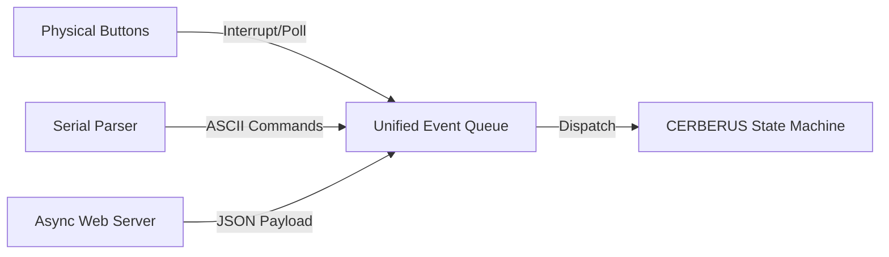

# CERBERUS: Gate Controller Implementation Details

For the hardware, the gate controller will be built around a simple ESP32-based Cheap Yellow Display (CYD) board paired with four physical buttons. Three of these buttons will mimic the gates, manually generating `EV_ARM`, `EV_START`, and `EV_GOAL` events when pressed. The fourth button is reserved to trigger the `EV_NEW_MOUSE` event.

The gate controller maintains a continuous serial link with the host computer. Through this connection, it can receive `EV_ARM`, `EV_START`, `EV_GOAL`, and `EV_NEW_MOUSE` override messages directly from the host. In the opposite direction, the serial link is used to mirror all generated events back to the host and report calculated run times.

To handle wireless events, the gate controller connects to a local Wi-Fi Access Point (AP). The individual intelligent gates communicate over this network by sending HTTP POST or GET requests to the controller. These payloads contain the gate's identity, the type of event, and a high-precision global timestamp derived from the Wi-Fi network's hardware TSF (Timing Synchronization Function) clock.

Because the TSF clock is automatically shared and synchronized across all devices at the hardware level, the timestamps attached to the gate messages are considered absolute. Network transmission latency therefore ceases to be an issue, ensuring highly accurate time-stamping regardless of network jitter. Ultimately, the gate controller uses these TSF timestamps to calculate individual run times, making its calculations the definitive record for all run and session timing.

HTTP messages from the gates should probably use POST requests with a JSON payload:

```JSON
POST /api/event
{
  "gate_id": "START_GATE",
  "event": "EV_START",
  "tsf_us": 4321098765,
  "gate_us": 1098765634,
}
```

Serial messages from the host, and button press events, will not be timestamped and their time should come from the gate controller itself. Note that the controller also has access to the global TSF time.

### Global Time Synchronization and Drift Mitigation

The Access Point (AP) serves as the definitive timekeeper for the system, distributing a unified global clock across the network via the Timing Synchronization Function (Function (TSF)) data embedded in its 802.11 beacon frames. So long as a single AP remains online and does not reset, this TSF clock provides a monotonic, universally accessible time baseline for all system components.

However, physical deployment environments introduce edge cases: an AP may experience a transient failure or reset, and if the available network is part of a dynamic mesh topology, the absolute reference time may abruptly shift. Additionally, individual gates or the controller may occasionally miss beacon frames due to localized RF interference. During these blackout periods, a component's localized TSF clock begins to drift relative to the AP. While this drift is small—typically on the order of 10 to 20 parts per million (ppm)—it can still accumulate a discrepancy of just over one millisecond after one minute of independent running.

To counter these synchronization anomalies, both the intelligent gates and the CERBERUS controller simultaneously track their own internal 1MHz hardware timers (esp_timer_get_time()) alongside the incoming Wi-Fi TSF counter. By establishing a continuous, localized relationship between the stable internal microsecond clock and the absolute TSF clock, each component can dynamically model and compensate for clock drift or short-term beacon loss. This dual-clock cross-referencing provides a robust fallback mechanism, preserving microsecond-level timing integrity even during a network disruption or an AP time shift for independent intervals up to five minutes.

Since events can arrive from multiple sources, CERBERUS will need a parser that can interpret each message and convert it ito a common format that can be stored in a unified system queue for processing by the main state machine.


Something like this would do for the common event type:

```C++
enum EventType {
    EV_NONE,
    EV_NEW_MOUSE,
    EV_ARM,
    EV_START,
    EV_GOAL,
    EV_RESTART
};

struct SystemEvent {
    EventType type;
    uint64_t timestamp_us; // TSF time if remote, local esp_timer_get_time() if local
    char payload[32];      // For passing Mouse Names via EV_NEW_MOUSE
};

```

Since the gate controller is an ESP32, it has two cores to help divide the responsibilities:
| Core / Thread | Component | Responsibility |
| :--- | :--- | :--- |
| **Core 0 (Networking)** | `AsyncWebServer` | Listens for incoming HTTP POST requests from remote gates, parses JSON, injects events into the queue with remote TSF timestamps. |
| **Core 1 (Control & UI)** | `Loop / State Machine` | Pulls from the Event Queue, processes state transitions, handles local GPIO buttons, and manages the CYD display refresh. |
| **Core 1 (Peripherals)** | `Serial Parser` | Monitored inside `loop()`. Parses incoming host strings (e.g., `NEW_MOUSE:MightyMouse\n`) and pushes them to the queue. |

---


On the ESP32, Core 0 is intended to be used for WiFi and networking tasks so that is where those tasks are best placed.

That leaves Core 1 for the application tasks where buttons and serial input can be monitored without delays caused by the networking overhead. Handling the event queue and display are then no longer so time critical and there is plenty of processor power available for these in a single core.
